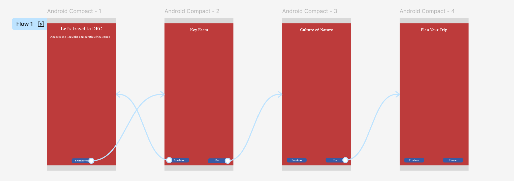

# Alpha Project
# Discover Democratic Republic of the Congo - Multi-Page Static website

## this project is 4 page static website built with HTML, CSS, and JavaScript. It offers an introduction to the Democratic Republic of the Congo, focus on key facts, culture & nature, and travel tips.

**Page included:**
- 'index.html' > Introduction
- 'keyfacts.html' > It is about capital and other important information
- 'culturenature.html' > Virunga National park and cultural information
- 'triptips.html' > simple information for trip and some local language word

## User Story
**As a curious traveler who wants to explore new destinations,  
I want a website that presents key facts, culture, and travel tips about the Democratic Republic of Congo,  
so that I can learn about the country and prepare for a future trip.**

## WireFrame 
The wireframe was created with figma, to have a basic structure of my website for my own guidance in the website creation

## How to view
**Live Site: https://sweetiesyvi.github.io/projetAlpha/**

**Repository: https://github.com/sweetiesyvi/projetAlpha?tab=readme-ov-file**

## code Snippet
<footer>
  
 2025 Discover Congo 

  <button id="theme-btn">Dark Mode</button>
</footer>

**I create a dark mode bouton for the dark mode with JavaScript.**

## validation links
**Nu HTML Validator: **

**WAVE Accessibility Report: **

## credits & collabs
**- Framework used google fonts**
**-tools:**
  - figma
  - VS Code
  - Github Pages
**-images source: google chrome, avast secure browser**
**-I use chatgpt and nova for suggestion explanation and guidance when I was really stuck.**
